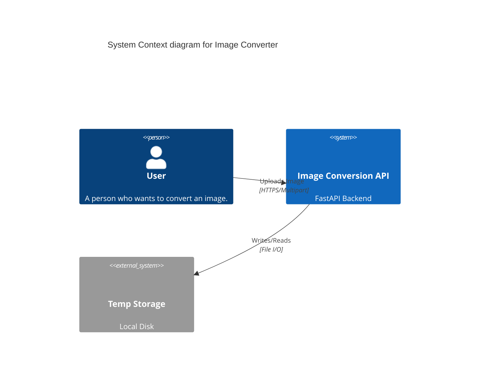

# Architectural Model

## System Context
The system is a simple file conversion utility.

## Backend Structure (Hexagonal)

The backend follows a Clean/Hexagonal architecture:

- **Domain (`backend/app/domain`)**:
  - `FileValidator`: Pure logic for validating file constraints (magic numbers, size).
- **Application (`backend/app/application`)**:
  - `UploadService`: Orchestrates the flow (Validate -> Save to Disk -> Return ID).
- **Presentation (`backend/app/presentation`)**:
  - `routers/upload.py`: FastAPI endpoints handling HTTP concerns (Multipart parsing, Error mapping).
- **Infrastructure**:
  - Currently direct File I/O within the Application Service (to be refactored into an Adapter if complexity grows).
